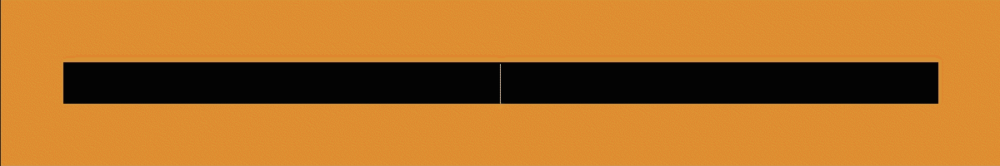
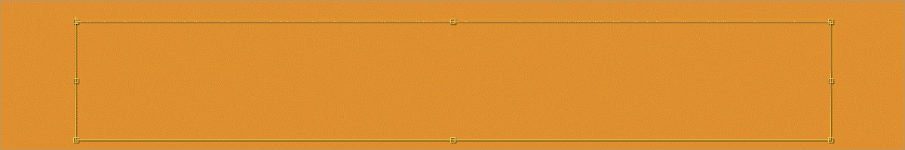

# База знаний

В этом разделе представлены часто используемые выражения при подготовке шаблонов для **Carrot Engine** в **Adobe After Effects**.

## Автомасштабирование текста по фиксированной ширине


Скопируйте это выражение в свойство **`Scale`** слоя **TEXTLAYER**:
	
### Без учёта свойства `Scale`:
```javascript
//=============================================================================
// AUTORESIZE TEXT LAYER TO BOUNDS WITH SCALE PROPERTY (BASIC)
//=============================================================================

var IN_Layer = thisComp.layer("TEXTLAYER");
var IN_Bound = 600; // Bound width in pixels

var IN_Width = IN_Layer.sourceRectAtTime().width;

var OUT_Width = 100; // Setting default value if condition is false

	if (IN_Width > IN_Bound) {
		OUT_Width = IN_Bound / IN_Width * 100;
	} else {
		OUT_Width;
	}

[OUT_Width,OUT_Width]
```

### С учётом свойства `Scale`:
```javascript
//=============================================================================
// AUTORESIZE TEXT LAYER TO BOUNDS WITH SCALE PROPERTY (ADVANCED)
//=============================================================================

var IN_Layer = thisComp.layer("TEXTLAYER");
var IN_Bound = 600; // Bound width in pixels

var IN_Width_unscaled = IN_Layer.sourceRectAtTime().width;
	// .sourceRectAtTime().width returns layer width without taking scale property into account.
	// We manually input text layer scale to get "true" width value further
var IN_Scale = 100;
var OUT_ScaleFactor = (IN_Scale - 100) * .01;

var IN_Width_scaled = IN_Width_unscaled + (IN_Width_unscaled * OUT_ScaleFactor);
	// If IN_Scale equals 100 then result in brackets will be zero leaving original unscalled values.

var OUT_Width = IN_Scale; // Setting default value if condition is false

	if (IN_Width_scaled > IN_Bound) {
		OUT_Width = IN_Bound / IN_Width_scaled * IN_Scale;
	} else {
		OUT_Width;
	}

[OUT_Width,OUT_Width]
```

## Динамическая плашка под размер текста из солида


> Скопируйте это выражение в свойство **`Scale`** слоя **SOLIDLAYER**:

### Без учёта свойства `Scale` текста:
```javascript
var IN_TextLayer = thisComp.layer("TEXTLAYER");
var IN_SolidLayer = thisComp.layer("SOLIDLAYER");
var IN_Margins = [0,25]; // Margins to make space between solid edges and text.
var IN_SolidSize_original = [512,512];
	// We manually input solid layer width and height, because this is static value that was set during layer creation. It remains unchanged.

var IN_Width = IN_TextLayer.sourceRectAtTime().width;
var IN_Height = IN_TextLayer.sourceRectAtTime().height;

	if (IN_Width == 0) // Making solid layer completely hidden when text layer is empty, otherwise if margins were set > 0 they would be visible.
	{
		IN_Margins = [0,0];
	}

var OUT_Width = (IN_Width + IN_Margins[0]) / IN_SolidSize_original[0] * 100;
var OUT_Height = (IN_Height + IN_Margins[1]) / IN_SolidSize_original[1] * 100;

[OUT_Width,OUT_Height]
```

#### Версия для Carrot Scripts в Template Preview

> Скопируйте эти выражение в поля `Startup` и `Set State` окна **Scripts** в **Template Preview**.

> Измените ссылку на нужный вам слой у переменных `InTextLayer` и `inSolidLayer`:

```js
// STARTUP
var inTextLayer = thisComp.layer(1); // Layer reference with index (Example: layer(1) or layer name (Example: layer("Name"))
var inSolidLayer = thisComp.layer(2); // Layer reference with index (Example: layer(1) or layer name (Example: layer("Name"))

var inSizeSolid = [512,512]; // We manually input solid layer width and height, because this is static value that was set during layer creation. It remains unchanged.
var inMargins = [0,25]; // Margins to make space between solid edges and text.

function FitLayerScaleToText (value, margin, sizeSolid) {
    var outScale;
    if (value == 0) // Making solid layer completely hidden when text layer is empty, otherwise if margins were set > 0 they would be visible.
    {
        margin = 0;
    }

    outScale = (value + margin) / sizeSolid * 100;
    return outScale;
}
```

```js
// SET STATE
var inWidth = inTextLayer.sourceRectAtTime().width;
var inHeight = inTextLayer.sourceRectAtTime().height;

inSolidLayer.transform.scale = [FitLayerScaleToText(inWidth, inMargins[0], inSizeSolid[0]), FitLayerScaleToText(inHeight, inMargins[1], inSizeSolid[1]), 0];
```

### С учётом свойства `Scale` текста:
```javascript
var IN_TextLayer = thisComp.layer("TEXTLAYER");
var IN_SolidLayer = thisComp.layer("SOLIDLAYER");
var IN_Margins = [100,25]; // Margins to make space between solid edges and text.
var IN_SolidSize_original = [512,512];
	// We manually input solid layer width and height, because this is static value that was set during layer creation. It remains unchanged.

var IN_Width_unscaled = IN_TextLayer.sourceRectAtTime().width;
var IN_Height_unscaled = IN_TextLayer.sourceRectAtTime().height;
	// .sourceRectAtTime() returns layer width/height without taking scale property into account.
	// We manually input text layer scale to get "true" width value further.
var IN_Scale = 100;
var OUT_ScaleFactor = (IN_Scale - 100) * .01;

	if (IN_Width_unscaled == 0) // Making solid layer completely hidden when text layer is empty, otherwise if margins were set > 0 they would be visible.
	{
		IN_Margins = [0,0];
	}

var IN_Width_scaled = IN_Width_unscaled + (IN_Width_unscaled * OUT_ScaleFactor);
var IN_Height_scaled = IN_Height_unscaled + (IN_Height_unscaled * OUT_ScaleFactor);
	// If IN_Scale equals 100 then result in brackets will be zero leaving original unscalled values.

var OUT_Width = (IN_Width_scaled + IN_Margins[0]) / IN_SolidSize_original[0] * 100;
var OUT_Height = (IN_Height_scaled + IN_Margins[1]) / IN_SolidSize_original[1] * 100;

[OUT_Width,OUT_Height]
```
> **Важно:** Для работы этого шаблона свойство **`Anchor Point`** у слоя **SOLIDLAYER** должно совпадать с выравниванием текста слоя **TEXTLAYER**.
>
>**Например:** Если выравнивание текста выставлено по левому краю, то **`Anchor Point`** у **SOLIDLAYER** должен находиться в левом краю слоя, вертикальное положение якоря задаётся исходя из дизайнерской задачи.

> **Примечание:** Вспомогательные переменные в выражениях можно привязать к значениям **элементов управления выражений** **(Expression Controls)**. 
>
> Эти элементы управления можно вывести в **Carrot Template Preview** в качестве новой переменной и редактировать её через **Carrot Web Playlist** без необходимости реэкспорта шаблона.
>
> Высота солида при вводе знаков "Й,у,ф" может изменится, указывайте в коде минимальную высоту слоя с учётом максимальной возможной высоты символов в одной строке, чтобы избежать "скачков".