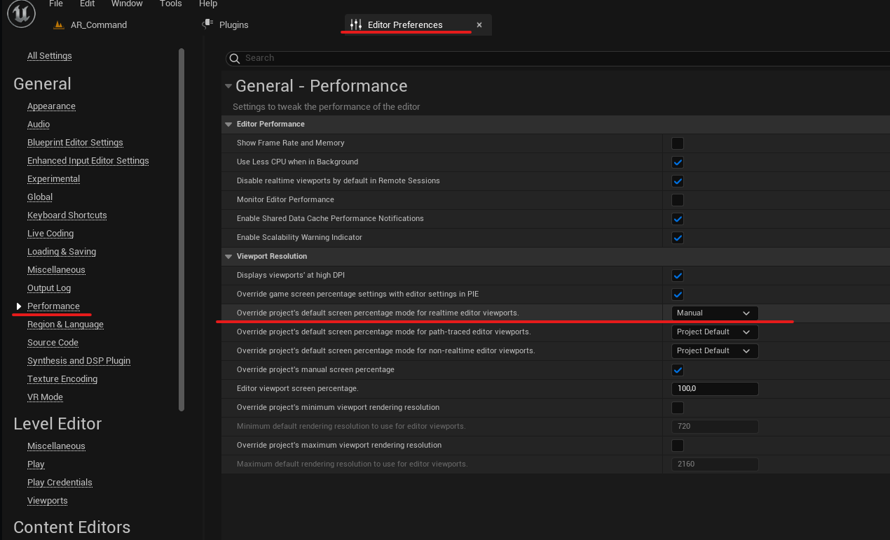

# База знаний

## Настройки ini-файла проекта для CARROT

Настройки под CARROT в окне **Project Settings** можно указывать напрямую в `DefaultEngine.ini`:

```ini
[/Script/Engine.RendererSettings]
r.DefaultBackBufferPixelFormat=0
r.PostProcessing.PropagateAlpha=2
r.CustomDepth=3

[/Script/Engine.Engine]
GameEngine=/Script/Carrot.CarrotGameEngine
GameViewportClientClassName=/Script/Carrot.CarrotViewportClient

[/Script/WindowsTargetPlatform.WindowsTargetSettings]
DefaultGraphicsRHI=DefaultGraphicsRHI_DX12
```
Команда для работы звука при неактивном окне Unreal Engine:
```ini
[Audio]
UnfocusedVolumeMultiplier=1.0
```

## Полезные команды

>В консоли можно узнать значение переменной, указав вместо значения символ "`?`".
<br>Например, `r.ShadowQuality ?` покажет заданное значение качества теней в проекте

### GPU Profiling & Measuring Performance
| | |
-|-
|`stat fps`| Displays FPS counter.
|`stat GPU`| Simplified Real-Time stats for the major rendering categories.
|`stat RHI`| Displays RHI memory and performance statistics.
|`ProfileGPU`| Maximized frame statistics.
|`stat Niagara`| Basic cost and memory overview.
|`stat NiagaraEmitters`| Frame information about the emitters.
|`stat NiagaraSystems`| Frame information about systems.
|`t.maxFPS`| Limits FPS (default = `0`).

### Shadows
| | |
-|-
|`r.ShadowQuality`| Defines the shadow method which allows to adjust for quality or performance (max = `5`).
|`r.Shadow.MaxResolution`| Max square dimensions (in texels) allowed for rendering shadow depths. Range 4 to hardware limit. (max = `2048`)

### Antialiasing & Upsampling
#### Temporal Anti-Aliasing
| | |
-|-
|`r.TemporalAA.Upsampling`| Whether to do primary screen percentage with temporal AA or not.
|`r.TemporalAA.Quality`| `0`: Disables input filtering.<br>`1`: Enables input filtering.<br>`2`: Enables input filtering with mobility-based anti-ghosting (default)
|`r.TemporalAACurrentFrameWeight`| Weight of current frame's contribution to the history.  Low values cause blurriness and ghosting, high values fail to hide jittering (default = `0.04`).
|`r.TemporalAASamples`| Number of jittered positions for temporal AA (`4`, default = `8`, `16`, `32`, `64`)
|`r.TemporalAAFilterSize`| Size of the filter kernel. (`1.0` = smoother, `0.0` = sharper but aliased).

### Другое
| | |
-|-
|`r.ScreenPercentage`| Render resolution scaling (default = `100`).

>Консольные команды можно применять к проекту, поместив их в `DefaultEngine.ini` следующим образом:

```ini
[SystemSettings]
r.GTSyncType=2 
rhi.SyncInterval=0 
r.Vsync=0 
rhi.SyncSlackMS=0 
r.OneFrameThreadLag=1
r.Streaming.PoolSize=16000
```

Команды для включения RTXGI:
```ini
[SystemSettings]
r.GlobalIllumination.ExperimentalPlugin=1
```

## Troubleshooting
### Рендер в UE5 происходит в меньшем разрешение если запускаться через **Play In Editor** (PIE)
Для того, чтобы рендерить в полном разрешении через редактор, нужно указать следующую настройку в **Editor Preferences**:

`General - Performance` > `Viewport Resolution` > `Override project's default screen percetage mode for realtime editor viewports` - Manual



Можно также прописать консольную команду:

```r.Editor.Viewport.OverridePIEScreenPercentage 0```