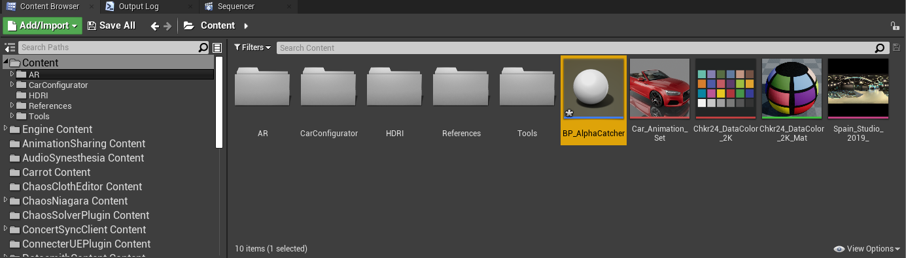

# База знаний

## Использование отдельного альфа-канала.

В этом разделе описано как получить отдельный альфа канал у AR объектов для работы с DLSS и прозрачными материалами (дым, огонь)

1. Создайте в UE проекте `Blueprint Actor`

2. Назовите его `BP_AlphaCatcher` и откройте

3. Добавьте `SceneCaptureComponent2D`

4. В свойствах `SceneCaptureComponent2D` в поле Texture Target создайте новый `Render Target`, укажите место сохранения и название 

Укажите следующие параметры текстуры

5. Укажите `Primitive Render Mode` - `Use ShowOnly List` и укажите требуемые типы объектов для захвата в полях `Show Flag`

6. В поле `Variables` создайте новую перемененную и укажите её тип `Cine Camera Actor` - `Object Reference`

7. Создайте логику при помощи ноды Get Actors, где мы получаем массив объектов в слое редактора и указываем их для отображения внутри камеры `Scene Capture Component 2D`

8. Все переменные долнжы быть отмечены как `Instance Editable`

9. Перетащите созданный `Blueprint Actor` на тот же уровень, что и Carrot камера, укажите в свойствах `BP_AlphaCatcher` название слоя с объектами и камеру

10. Вернитесь в `BP_AlphaCatcher` и добавьте логику для синхронизации настроек `CaptureComponent2D` с камерой в сцене

11. Откройте материал `PostProcMat_Frames` в папке CarrotContent. Если папка не отображается, то поставьте галочку напротив опции Show Plugin Content в `View Options`.

12. В материале замените выход Opacity на инвертированный альфа канал полученной `Render Target` текстуры.

